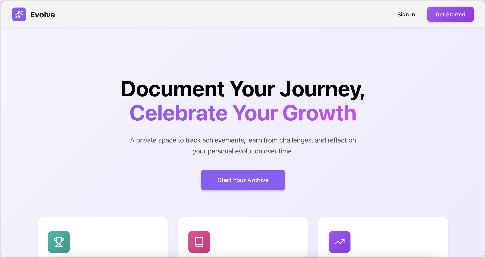

# Evolve

## Description

Evolve is a personal growth web application designed to help users document their achievements and reflect on their journey of self-development. It provides a secure and private digital space where individuals can celebrate their progress, learn from challenges, and understand their personal evolution over time.

The application serves as a comprehensive digital archive for achievements, lessons, emotions, and insights, allowing users to revisit older entries to track long-term growth and understand how past experiences shape their development.

## Getting Started

- **Deployed Application:** https://evolve-frontend-czns81cna-maryams-projects-85cf0171.vercel.app
- **Planning Materials:** https://trello.com/invite/b/6905e72a348f6b584fcef071/ATTI6e185b994257cc5bd884870420abad64690291C7/evolve
- **Back-End Repository:** https://github.com/Maryam308/evolve-backend.git

## Attributions

- [Lucide React](https://lucide.dev/) - Icon library
- [Pinterest](https://pinterest.com/) - Design inspiration

## Technologies Used

### Frontend
- **JavaScript** - Programming language
- **React** - Frontend framework
- **Vite** - Build tool and development server
- **React Router DOM** - Client-side routing
- **CSS** - Styling and layout
- **Context API** - State management

### Backend
- **Node.js** - Runtime environment
- **Express.js** - Web application framework
- **MongoDB** - NoSQL database
- **Mongoose** - MongoDB object modeling
- **JWT (JSON Web Tokens)** - Authentication and authorization
- **bcrypt** - Password hashing

## Next Steps

Planned future enhancements include:

- **Image Attachments** - Allow users to upload and attach images to their entries
- **Export Functionality** - Enable users to export their entries as downloadable PDF reports
- **Advanced Visualizations** - Implement interactive timelines and growth charts
- **Search Capabilities** - Add advanced search functionality across all entries
